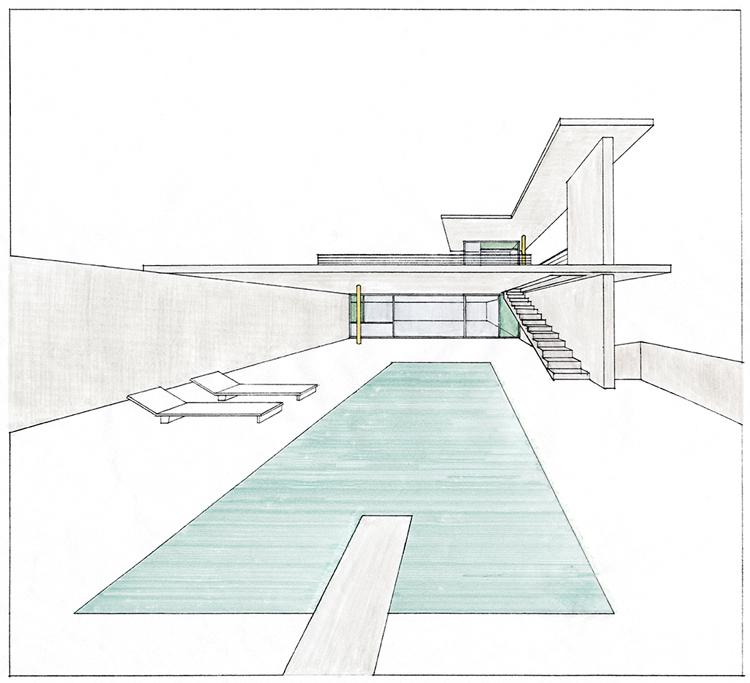

_ _ _
**SUN YAT-SEN UNIVERSITY**



# Homework 5: Views &&  Perspective
###### Computer Graphics
###### 2017-01-01

### 1. Introduction
***So*** far we have learn how to move the objects in the virtual world, but it seems that we always observe the virtual world in a fix position. Hence, let's move around and look around on this world! In this homework, you are required to manipulate the *view/camera* in OpenGL and to know the differences and correlation between this homework and homework6. 

***Warning：*** All codes and documents should be written and submitted individually, without copying existed answers (Neither from other student nor from the Internet). ***Plagiarism = Fail***. Besides, there may be at least 30% penalty for late homework.

### 2. Tasks

####2.1 Pre-requirement
- Language: **Only C/C++ is accepted in this homework.**

- Libraries: **Only OpenGL and freeGLUT/GLFW can be used.**

- OS/IDE: **Any OS/IDE can be used.**

- The cube you've drawn in homework4 is needed. Each face of the cube should be colored differently. The size of the cube should be **0.1x0.1x0.1**.

####2.2 Projections
Projection define how a virtual 3D world projects into a 2D screen such that we can see it. There are 2 kinds of projections are used in OpenGL: perspective projection and orthographic projection. 

- Place the cube in **(0.5,-0.5,-1.5)** and create a orthographic projection. Show what you get in the report. Try different parameters(i.e.  `left, right, bottom, top, near, far`), and write down how these parameters affect result in the report.

- Place the cube in **(0.5,-0.5,-1.5)** and create a perspective projection. Show what you get in the report. Try different parameters, and write down how these parameters affect result in the report.

- Use exactly same parameters for 2 projections and discuss the differences of 2 results. Post the result in your report and discuss why.

-  Write down your main algrithm in the report.

####2.3 View Changing
You are required to change the view of the camera to observe the cube.

- Place the cube in (0,0,0), use the perspective projection. Import `glu.h`, try `gluLookat(...)` function. Let your camera circle around the cube, but looking at the cube all the time. 

- Show the results and write down your main algrithm in the report. 

- In practice, the camera setting is actually stored in a matrix called **View matrix**. The transformations is also stored in a matrix called **Model  matrix**. However, in OpenGL, these two matrices is actually one matrix called **ModelView matrix**. Discuss why it is so in the report. (Hints: Is there an actual camera object in virtual world? If there is not, how to pretend we have one?)

Hints: You may want to change your camera position in a circle. Try:
```cpp
camPosX=sin(clock()/1000.0)*Radius;
camPosZ=cos(clock()/1000.0)*Radius;
```
Since `sin(x)^2+cos(x)^2=1`, that make sure we form a circle in XoZ plane.

####2.4 Bonus: the Camera Class
Implement a `Camera` class to provide a FPS (First Person Shooting) view, which means when you press `w,a,s,d`, it would feel like if you were 'walking around' in the virtual world. When you move your mouse, it would feel like if you were 'looking around'. 

Hints: 
The header of the `Camera` may be:(You can change it if you like)
```cpp
class Camera{
public:
	...
	void moveForward(GLfloat const distance);
	void moveBack(GLfloat const distance);
	void moveRight(GLfloat const distance);
	void moveLeft(GLfloat const distance);
	...
	void rotate(GLfloat const pitch, GLfloat const yaw);
	...
private:
	...
	GLfloat pfov,pratio,pnear,pfar;
	GLfloat cameraPosX,cameraPosY,cameraPosZ;
	GLfloat cameraFrontX,cameraFrontY,cameraFrontZ;
	GLfloat cameraRightX,cameraRightY,cameraRightZ;
	GLfloat cameraUpX,cameraUpY,cameraUpZ;
	...
};
```
P.S. In the method `void Camera::rotate(GLfloat const pitch, GLfloat const yaw)`, 'pitch' and 'yaw' means the Euler angles. Euler angles are 3 values that can represent any rotation in 3D, defined by Leonhard Euler somewhere in the 1700s. The following image gives them a visual meaning:


### 3. Submitting Format

**Please submit your homework to sysucg2017@163.com. You subject of the email should be as same as your attachment(aka. your .zip file)**

Only a .zip file should be submitted. Under the .zip file, the content should look like this:

classTpye\_studentID\_Name\_hw?\_version?/
　　|— src/
　　|— doc/
　　|— bin/

- classType: R for required class(必修班); E for elective class(选修班).
- studentID: 1xxxxxxx
- Name: Your **Chinese** Name.
- hw?: Specific which homework you are submitting.
- version?: Specific if you modify your submitted homework, only the last version would be graded. **Started with version0**.
- src/: The folder holds your project, including **source files**.(Make sure you execute the clean command, we don't need those temporary files)
- doc/: **Only one PDF** should be included.
- bin/: **Executable program** and a **ReadMe.txt** to tell us how to run your program.

For example, a student in required class want to submit homework2 for the second time, his .zip file should be:

　　R\_16214382\_杨耀兴\_hw2\_version1.zip
  　　　　|—R\_16214382\_杨耀兴\_hw2_version1/
  　　　　  　　｜—src/  　　　　  　　——放整个工程
  　　　　  　　｜—doc/  　　　　  　　——放report.pdf
  　　　　  　　｜—bin/  　　　　  　　——放可执行文件和readme
